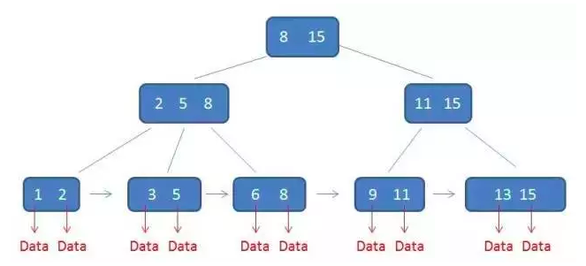

# B+树

> 参考：[漫画算法：什么是 B+ 树？](https://www.jianshu.com/p/1f2560f0e87f) 

## 特性

> B+Tree 在 B-Tree的基础上还具备如下特性：

+ 有k个子树的中间节点包含有k个元素（B树中是k-1个元素），每个元素不保存数据，只用来索引，所有数据都保存在叶子节点。

+ 所有的叶子结点中包含了全部元素的信息，及指向含这些元素记录的指针，且叶子结点本身依关键字的大小自小而大顺序链接。

+ 所有的中间节点元素都同时存在于子节点，在子节点元素中是最大（或最小）元素。

   

  ## 优势

  1. 单一节点存储更多的元素，使得查询的IO次数更少。

  2. 所有查询都要查找到叶子节点，查询性能稳定。

  3. 所有叶子节点形成有序链表，便于范围查询。

