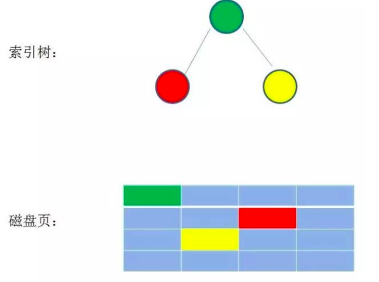
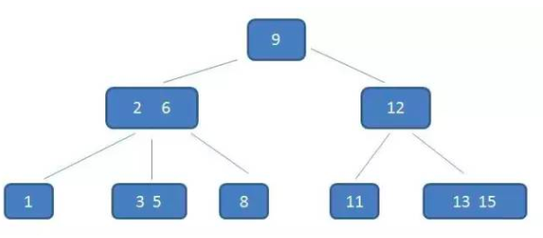

# B树

> 参考资料：[漫画算法：什么是 B 树？](http://blog.jobbole.com/111757/) 

## 由来

​	二叉查找树的时间复杂度为`O(logN)`，已经很低了，但是由于每个节点最多有2个子节点，所以导致`二叉查找树`是一种`瘦高`的树。

​	而在`mysql`这样的案例中，索引在磁盘中是这样存储的：

​	 

​	由于数据量过大，不可能将完整的索引读取到内存中，所以只能逐个加载；在磁盘中，每个节点对应1个磁盘页。

​	使用`二叉查找树`存储索引时，树的高度即为磁盘IO的次数。而磁盘IO速度是极慢的，所以尽可能减少磁盘IO次数，才能真正提高查询效率

​	而减少磁盘IO次数的方式就是降低树的高度，使原本瘦高的树变成矮胖的树，这就是`B-Tree`

## 特征

+ 根结点至少有两个子女。
+ 每个中间节点都包含k-1个元素和k个孩子，其中 m/2 <= k <= m
+ 每一个叶子节点都包含k-1个元素，其中 m/2 <= k <= m
+ 所有的叶子结点都位于同一层。
+ 每个节点中的元素从小到大排列，节点当中k-1个元素正好是k个孩子包含的元素的值域分划。

 

## 插入删除

> B-Tree是多路自平衡树，当插入或删除数据时，他会进行调整达到新的平衡状态