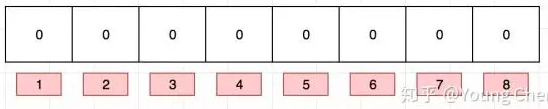
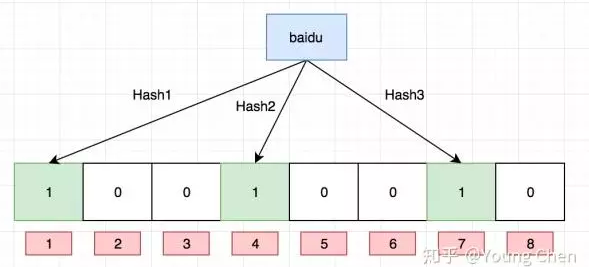
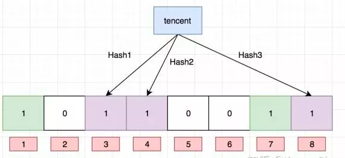
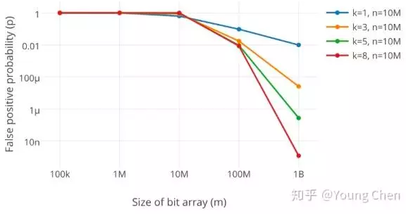

# 布隆过滤器

> 参见：[详解布隆过滤器的原理、使用场景和注意事项](https://www.jianshu.com/p/2104d11ee0a2) 

## 什么是布隆过滤器

+ 布隆过滤器是一种数据结构
+ 插入和查询效率很高
+ 占用空间更小
+ 效率更高
+ 可以用来告诉你：某样东西不存在或者可能存在

## 原理

+ 布隆过滤器使用bit数组存储数据

   

+ 向布隆过滤器中插入数据时，使用多个不同的哈希函数生成多个不同的哈希值，并将这几个哈希值作为下标指向的位`置1`，如：

  先插入`baidu`

   

  再插入`tencent`

   

+ 当我们需要查询某个值是否存在时，则根据该值生成多个哈希值，并判断这几个哈希值作为下标指向的位是否都为1

  + 如果有任意一位不为1，则该值一定不存在

  + 如果全为1，则该值可能存在，因为这几位可能都是在插入多个其他值时分别被置1的

    如：上图中，如果`bidding`哈希后的3个值为1、4、8，这三位均为1；但是1、4是在插入`baidu`时被置1的，8是在插入`tencent`时被置1的，而`bidding`这个值可能被插入过，也可能没被插入过

## 不支持删除

+ bit数组中的某一位可能被多个值置1过，也可能只被1个值置1过

  当我们删除某个值时

  + 如果我们选择把该值对应的位重新置0
    + 如果所有位都只被该值置1过，没有问题
    + 如果其中有几位被多个值置1过，此时我们将其置0，则判断其他值时，会导致明明存在的值返回不存在
  + 如果我们选择不把该值对应的位重新置0，则bit数组中被置1的位将越来越多，并且准确率会越来越低

+ 如果需要支持删除，可以将bit数组变为int数组，插入时每位值自增1，删除时每位值自减1

  但是这样将增加存储空间

## 选择哈希函数个数与过滤器长度

布隆过滤器准确率与哈希函数个数、布隆过滤器长度关系如下

+ 哈希函数个数越多，准确率越高；但是哈希函数个数越多，过滤器被置满的速度越快，准确率下降速度越快
+ 布隆过滤器长度越大，准确率越高

如图：

 

上图中：m：过滤器长度；k：哈希函数个数；n：数据量；p：准确率

## 实践

+ 利用布隆过滤器减少磁盘 IO 或者网络请求
+ 尽量使用性能较高的哈希函数，如：MurmurHash、Fnv 

## 布隆过滤器拆分

+ redis本身支持bitmap操作，天然适合做布隆过滤器，但是布隆过滤器的不当使用将产生较大的布隆过滤器，造成redis阻塞，因此需要对布隆过滤器进行拆分
+ 拆分原则为：将1个大的布隆过滤器拆分为多个bitmap，或分布在多个节点上，并且保证每个值的多个哈希函数的值落在同1个bitmap上

