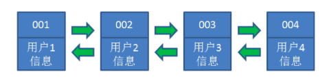
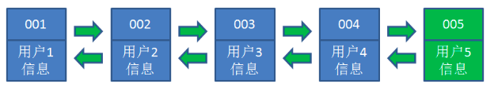
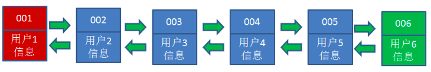
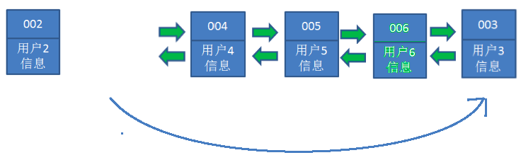

# LRU算法

> 参考：[漫画：什么是LRU算法？](https://mp.weixin.qq.com/s/L-rTC-qlnvKxbwUI1FmeHw) 

## 作用

> LRU算法用于保留最近使用记录，删除最不常使用记录

## 原理

+ LRU算法使用[哈希链表](../LinkedHashMap/LinkedHashMap.md)数据结构，对于哈希链表中每条链表如下图

   

  最左端表示最不常使用的数据，最右端表示最常使用的数据

+ 当插入新数据时

  + 如果此时链表未满，直接插入到最右端即可

     

  + 如果此时链表已满，则需要移除最左端的1个数据，并将新数据放入最右端

     

+ 当再次使用到链表中已存在的数据时，将该数据移动到最右端

   

## 应用

+ Redis底层实现了LRU算法来进行内存回收
+ 如果需要代码中使用LRU算法，可以使用继承自`LinkedHashMap`的`LRUCache`类

