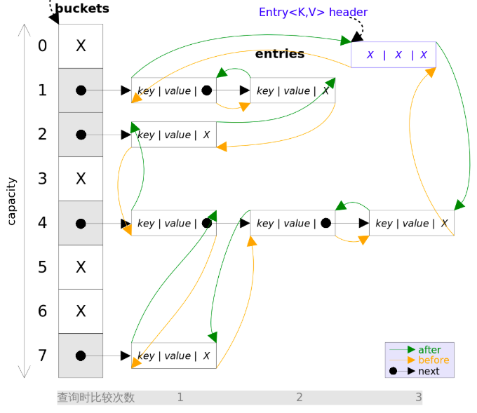
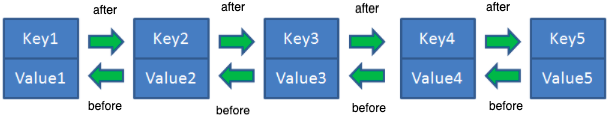

# 哈希链表

## 原理

+ 哈希链表就是在哈希表的基础上，在每个节点中，增加了`before`、`after`两个指针，根据用户需要的顺序（如：按插入顺序、访问顺序），指向上一个和下一个节点

   

+ 这样从`before`、`after`这两个指针的角度看，哈希链表就变成了1条有序的双向链表，可以抽象为下图

   

## 应用

+ 哈希链表可以用于实现[LRU算法](../LRU/LRU.md) 
+ `LinkedHashMap`就是基于哈希链表实现的，不过存储的结构没有采用哈希表，而是采用`HashMap`中数组+红黑树的形式