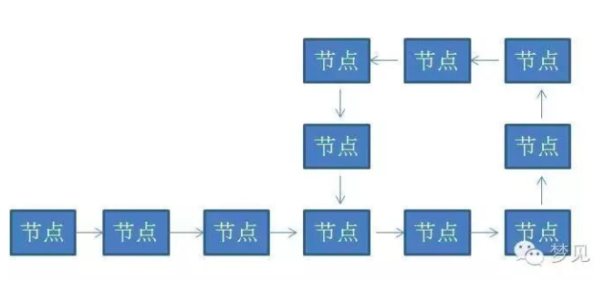
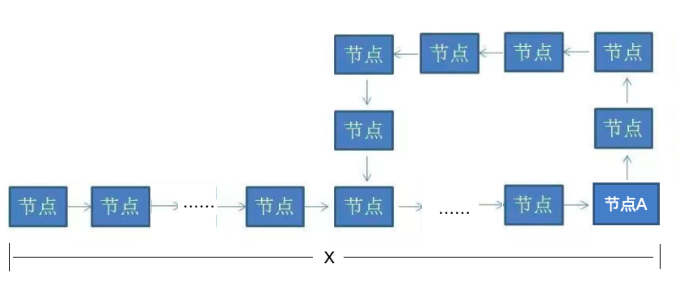
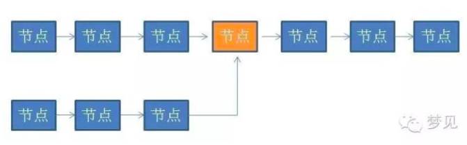

# 判断链表有环

> 参见：[漫画算法：如何判断链表有环？](https://zhuanlan.zhihu.com/p/31401474)

## 文中遗留问题

+ 上文中提到如下内容

  > 假设从链表头节点到入环点的距离是D，链表的环长是S。那么循环会进行S次（为什么是S次，有心的同学可以自己揣摩下）

   

+ 证明如下

   

  假设循环`X`次后，快指针与满指针相遇与节点`A`，此时快指针已经基于节点`A`绕环`n`圈了，则存在如下关系：

  ```
  2X = nS + X
  ```

  则：X = nS

  所以：X必为环长的倍数

  因为：X >= D，且我们取`X`是快慢指针第一次相遇时的循环次数

  所以：X为大于等于D的最小的S的倍数

  ​	当D <= S时，X = S

  所以上文中的表述并不完整，完整表述为：

  > 假设从链表头节点到入环点的距离是D，链表的环长是S，==且D<=S==，那么循环会进行S次（为什么是S次，有心的同学可以自己揣摩下）

+ 拓展

  假设`相遇节点A`顺时针到`相交节点`的距离为`Y`，则：`X=D+S-Y`

  根据`X=nS`，则：nS = D + S -Y，可以推出：D=nS + Y

## 判断两个链表是否相交，求出交点

 

+ 判断相交

  将其中一条链表首尾相连，使用上文中办法证明相交

+ 求交点

  在判断相交之后的基础上，设置2个指针，一个指向起始节点，另一个指向相遇节点A，两个指针均以步长为1向前遍历，直到这两个指针相遇，则找到相交节点。

  >  根据上节`拓展`的结论，D=nS + Y，
  >
  > 当起始节点开始的指针走到相交节点时，循环了`nS+Y`次，而相遇节点开始的指针循环`nS+Y`次后，正好也落在相交节点上


> 文中最后的两个问题是一个题，问题2就不在赘述了