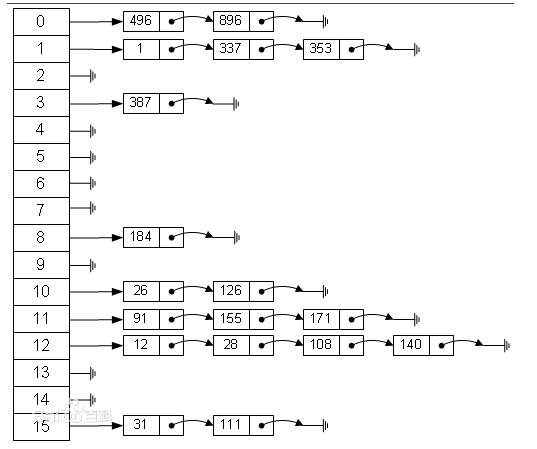

# 哈希表

> 参考资料[数据结构之哈希（hash）表](https://www.cnblogs.com/s-b-b/p/6208565.html) 

哈希表(hashTable)又称散列表，原理就是数组+链表

 

+ 如上图，指定1个长度为16的哈希桶，当插入数据时，使用数据`key`的哈希值对16取模得到对应哈希桶中的位置，然后将数据插入该位置对应的链表中
+ 不要纠结哈希桶里存不存数据，存不存都是哈希表