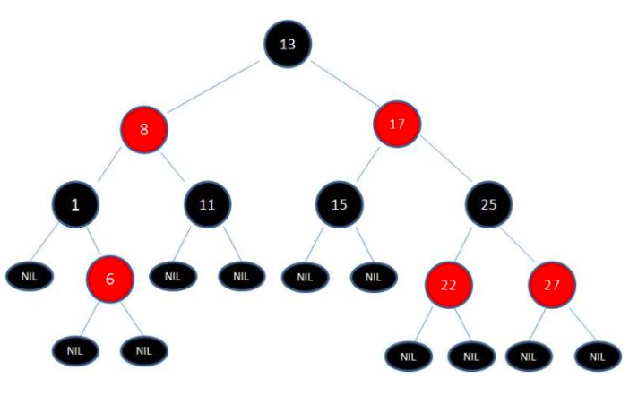

# 红黑树

> 参考资料：[什么是红黑树](https://zhuanlan.zhihu.com/p/31805309) 
>

+ 二叉查找树

  ​	红黑树的本质是一颗二叉查找树

  ​	二叉查找树的时间复杂度为`O(logn)`，但如果二叉查找树中的每个子节点都在其父节点的同一侧时，则二叉查找树又变回了链表，时间复杂度为`O(n)`

  ​	所以，为了提高查询效率，在插入删除节点时，对树进行调整，使其尽可能保持平衡。这就是红黑树

+ 红黑树特性

  + 每个结点要么是红的，要么是黑的。  

  + 根结点是黑的。  

  + 每个叶子节点都是黑色的空节点（NIL节点）。

  + 如果一个结点是红的，那么它的俩个儿子都是黑的。  

  + 对于任一结点而言，其到叶结点树尾端NIL指针的每一条路径都包含相同数目的黑结点。

     

    > 上述特性，决定了：
    >
    > 红黑树根节点到叶子的最长路径不会超过最短路径的2倍

+ 调整

  当红黑树中插入新节点时，可能会破坏原有的结构，此时可以通过如下办法进行调整：

  + 变色
  + 左旋转
  + 右旋转

  具体的细节就不需要了解了，知道自平衡调整的主体思想就可以了