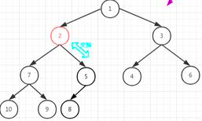
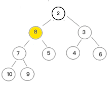

# 堆

## 什么是堆

堆是一种特殊的树，只要满足下面两个条件，它就是一个堆：

+ 堆是一颗完全二叉树；

+ 堆中某个节点的值总是不大于（或不小于）其父节点的值。

其中，我们把根节点最大的堆叫做大顶堆，根节点最小的堆叫做小顶堆。

### 满二叉树

满二叉树是指所有层都达到最大节点数的二叉树。比如，下面这颗树：

 

### 完全二叉树

完全二叉树是指除了最后一层其它层都达到最大节点数，且最后一层节点都靠左排列。比如，下面这颗树：

 

满二叉树是一种特殊的完全二叉树。

## 如何存储完全二叉树(堆)

### 使用数组

将完全二叉树中所有节点数据从上之下、从左至右依次放入数组中，数组下标从1开始

 

放入数组后如下图

 

### 为什么从下标为1开始

这样存储后，任意节点下标除以2就可以得到其父节点下标

如：上图中8的下标为5，其父节点下标为5/2=2，所以其父节点值为5

## 操作堆

### 插入

#### 过程

+ 将新数据插入到堆的最后一层的最后一个节点的下一个节点

   

+ 堆化

  以小顶堆为例

  将新节点与其父节点进行比较，如果新节点小于其父节点，则交换其与父节点的位置，重复此步骤直到新节点不小于其父节点

    

#### 时间复杂度

由使用数组存储堆的原理知道，新节点每次与n/2节点进行比较，比较x次到达下标为n/2^x^的节点，最坏情况下到达堆顶，则n/2^x^=1，所以x=log~2~n，则时间复杂度为O(logn)

### 删除堆顶元素

注意：除了删除`堆顶元素`或`最后一层最后一个元素`以外的元素是需要重新建堆的，所以这里我们只探讨删除堆顶元素

#### 过程

+ 删除堆顶节点，并使用最后一层的最后一个节点替换他

    

+ 堆化

  将替换节点与其两个子节点进行比较，若大于任意子节点，则与较小的子节点交换位置，重复此步骤直到替换节点不大于任意子节点

     

#### 时间复杂度

O(logn)

### 建堆

#### 过程

建堆的过程就是不断向1个新的堆中插入元素的过程

#### 时间复杂度

+ 时间复杂度为：O(n)
+ 自己没推导出来，推导过程参见《算法导论》第6章

### 堆排序

#### 过程

堆顶元素始终是最小元素(小顶堆)

不断的取出堆顶元素并堆化，则堆顶元素的取出顺序就是排序后的顺序

#### 时间复杂度

O(nlogn)

